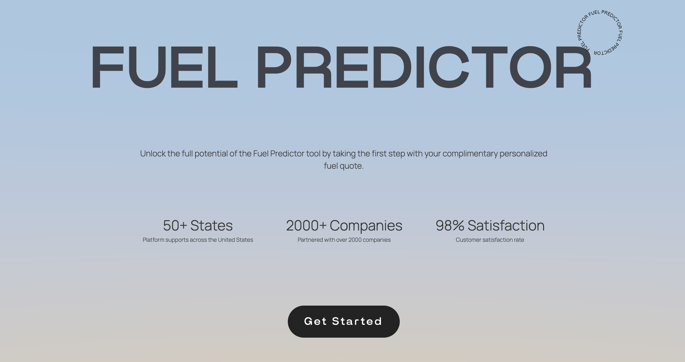

<div>
    <div style="display: flex; justify-content: center;">
        
    </div>
  <h1 align="center" style="font-size: 36px;">
    Fuel Predictor
  </h1>
  <p>
    Welcome to the Fuel Predictor application! This project aims to provide accurate predictions for fuel consumption in vehicles based on various factors, ultimately assisting in generating fuel quotes. Whether you're a vehicle enthusiast, a researcher, or a professional in the automotive industry, our goal is to offer insights into fuel efficiency to optimize driving experiences and inform decision-making processes.
  </p>
</div>

-----

### About the Fuel Predictor Project

Welcome to our cutting-edge Fuel Predictor full-stack website project! This endeavor was pursued as part of the Software Design course (COSC 4353) at the University of Houston. Our objective was to develop and deploy an advanced fuel prediction system, customized to assist clients in making informed decisions when purchasing fuel, considering a range of influential factors.


# Project Requirements
<h6>Each bullet will route to the specific instance in which we have implemented them</h6>

1. [**Fuel Rate Prediction Software: Initial Design and High-Level Architecture**](#assignment1)
2. [**Front-End Development for Web Application: Building Client Interface**](#assignment2)
3. [**Back-End Development for Web Application: Implementing Functionality**](#assignment3)
4. [**Database Creation and Integration with Web Application**](#assignment4)

# Technologies

**Frontend**:
   


**Backend**: 
 

**Database**: 


**Testing**: 
 

**Authentication**: 


**Deployment**: 


**Version Control**:


# Hosting Locally

- If you haven't already, install Git on your machine.
- Ensure that your machine has the latest version of Node.js installed. Older versions of Node.js may not support some features.

### Cloning The Repository

```bash
git clone https://github.com/reemdelziz/Fuel-Rate-Prediction.git
cd Fuel-Rate-Prediction
code .
```

### Starting The Client

```bash
cd client        # If not already in the client directory.
npm i            # Install dependencies.
npm start        # Start the client.
```

> NOTE
> A new window will automatically open in your default browser on `http://localhost:3000`.

### Starting The Server

```bash
cd server        # If not already in the server directory.
npm i            # Install dependencies.
npm start        # Start the server.
```
# Unit test/test coverage report

### Unit test
```bash
cd server       # Go into server directory to run test 
npm test        # View test
```

### Test coverage report
```bash
cd server                 # Go into server directory to run test coverage report
npm run test:coverage     # Run test coverage report
```

<a name="assignment1"></a>

# Fuel Rate Prediction Software: Initial Design and High-Level Architecture
Click to view the Initial Design and High-Level Architecture
- [Fuel Prediction Architectural Design](./documentation/Fuel_Prediction_Architectural_Design.pdf) 
- [Fuel Prediction Project](./documentation/Fuel_Prediction_Project.pdf)
### Initial Thoughts on Design:
- Our initial thoughts on designing the fuel prediction application involve creating a user-centric interface that prioritizes ease of use and accessibility. We aim to streamline the user experience by providing clear navigation and intuitive forms for inputting data. Additionally, we plan to implement robust backend functionalities to ensure accurate predictions and efficient data management.

### Development Methodology:
- We have chosen to implement the Agile methodology for developing this application due to its iterative and flexible approach. Agile allows us to adapt to changing requirements and feedback from stakeholders throughout the development process. By breaking down the project into manageable sprints, we can continuously deliver working software and gather valuable insights to inform our decision-making.

### High-Level Design / Architecture:
#### Frontend:
- Login Module: Allows clients to register if they are new users or log in with their credentials.
- Client Registration: Initially collects only username and password, with the option to complete the profile after logging in.
- Client Profile Management: Enables clients to update their profile information, including full name, address, and other details.
- Fuel Quote Form: Provides a user-friendly interface for entering fuel-related data such as client location, history, and gallons requested.
- Fuel Quote History: Displays a list of previous fuel quotes for each client.
#### Backend:
- User Authentication: Implements authentication for different user roles, including Admin, Employee, and User.
- Client Information Management: Stores and manages client profiles, including registration details and profile updates.
- Fuel Quote Module: Handles the prediction of fuel rates based on client input, such as location, history, and gallons requested.
- Pricing Module: Calculates the fuel rate and total cost based on input data and company profit margin.
- Database Integration: Integrates with a database to store client information, fuel quotes, and other relevant data.

<a name="assignment2"></a>

# Front-End Development for Web Application: Building Client Interface    
### Description:
In this assignment, the focus is on building the front end for the web application designed in Assignment 1. The objective remains the same as Assignment 1, aiming to create a user-friendly interface for the fuel prediction application.
### Key Requirements
- Implement validations for required fields, field types, and field lengths to ensure data integrity.
- Ensure that the fuel quote form retrieves the delivery address from the client's profile and displays it as non-editable.
- Provide a clean and intuitive user interface for seamless navigation and interaction.
### Integration
Integrating React, Three.js, and CSS allowed us to create a dynamic and visually striking front end for our web application. By combining the power of React for component-based UI development, Three.js for immersive 3D graphics, and CSS for styling and formatting, we were able to deliver a seamless and engaging user experience. The modular nature of React enabled us to easily incorporate Three.js components into our application, while CSS provided the flexibility to customize the appearance and behavior of our UI elements according to our design requirements. Overall, the integration of these technologies resulted in a modern, responsive, and feature-rich front end for our application.

<a name="assignment3"></a>

# Back-End Development for Web Application: Implementation Overview  

### Description:
In this phase of our project, we've successfully completed the back-end development for the web application that we initially designed in Assignment 1. Our focus was on implementing essential functionality to support user authentication, client profile management, and fuel quote handling.

### Implementation Details:
- **Login Module:** We've built a robust login module that allows users to securely authenticate and access the application. User credentials are verified against stored data to grant access.
- **Client Profile Management Module:** Our application now features a comprehensive client profile management module. Clients can easily update their profiles with relevant information such as full name, address, and contact details.
- **Fuel Quote Module:** We've implemented a sophisticated fuel quote module to handle quote requests from clients. This module maintains a history of quotes for each client, facilitating efficient tracking and management.
- **Pricing Module:** While the pricing module is a critical component, we've created a placeholder class for now. Implementation of the pricing logic will be finalized in a later assignment.

### Important Deliverables:
- **Validation:** Extensive validations have been implemented to ensure that all required fields, field types, and field lengths adhere to specified criteria, enhancing data integrity and reliability.
- **Unit Testing:** All back-end code has undergone rigorous unit testing, achieving a code coverage of over 80%. We utilized code coverage reports generated by industry-standard tools to assess the comprehensiveness of our testing efforts.
- **Front-End Integration:** Seamless communication has been established between the front end and back end of our application. Data exchange, validation, and preparation for persistence to a database are seamlessly handled to provide a cohesive user experience.

### Technologies Used:
- Node.js and Express.js for server-side development.
- Jest for unit testing and achieving code coverage.
- JSON Web Tokens (JWT) for secure user authentication.

<a name="assignment4"></a>

# Database Creation and Integration with Web Application     

### Description:
In this assignment, we focused on creating the database schema and integrating it with our web application. The objective was to establish a robust data storage system that efficiently manages user credentials, client information, and fuel quotes.

### Implementation Details:
- **Database Creation**: We employed a relational (RDBMS) database technology to create the database schema. The database was tailored to accommodate the specific requirements of our application, ensuring optimal performance and scalability.
- **Table and Document Design**: The database schema comprised multiple tables/documents, including 'userAuth', 'profile', and 'quote'. Additional tables/documents, such as 'state', were incorporated to enhance data organization and accessibility.
- **Validation and Data Integrity**: Stringent validations were implemented to enforce data integrity and reliability. We ensured that all required fields, field types, and field lengths adhered to specified criteria, mitigating the risk of data corruption or inconsistency.
- **Backend Integration**: The backend of our web application was seamlessly integrated with the database, allowing for efficient retrieval and manipulation of data. Form data was dynamically populated from the backend, enabling smooth interaction with the user interface.
- **Unit Testing and Code Coverage**: Comprehensive unit tests were conducted to validate the functionality of the database implementation. Code coverage was maintained above 80%, ensuring thorough testing of all critical components.

### Key Components:
- **userAuth**: This table/document stores user IDs and encrypted passwords, facilitating secure authentication and access control.
- **profile**: Client details, including full name, address, and contact information, are stored in this table/document, enabling personalized service delivery.
- **quotes**: Fuel quote data, such as client location, history, and requested gallons, is recorded in this table/document to facilitate accurate prediction and tracking of fuel rates.
- **Additional Tables/Documents**: Custom tables/documents, such as states, were included to enhance data organization and support additional functionality.

### Deliverables and Documentation:
- **Database Schema**: The finalized database schema, including table/document structures and relationships, is documented in detail. This documentation provides insights into the database design and facilitates future maintenance and expansion.
- **Testing Results**: Detailed test reports, including test cases and outcomes, are available to assess the reliability and robustness of the database implementation.
- **Collaboration and Version Control**: GitHub was utilized for collaboration and version control, allowing team members to collaborate effectively and track changes to the database schema and codebase.

### SQL Dump File
```sql
CREATE DATABASE  IF NOT EXISTS `fuelpredictor` /*!40100 DEFAULT CHARACTER SET utf8mb4 COLLATE utf8mb4_0900_ai_ci */ /*!80016 DEFAULT ENCRYPTION='N' */;
USE `fuelpredictor`;
-- MySQL dump 10.13  Distrib 8.0.25, for macos11 (x86_64)
--
-- Host: fuelpredictor.mysql.database.azure.com    Database: fuelpredictor
-- ------------------------------------------------------
-- Server version	8.0.36

/*!40101 SET @OLD_CHARACTER_SET_CLIENT=@@CHARACTER_SET_CLIENT */;
/*!40101 SET @OLD_CHARACTER_SET_RESULTS=@@CHARACTER_SET_RESULTS */;
/*!40101 SET @OLD_COLLATION_CONNECTION=@@COLLATION_CONNECTION */;
/*!50503 SET NAMES utf8 */;
/*!40103 SET @OLD_TIME_ZONE=@@TIME_ZONE */;
/*!40103 SET TIME_ZONE='+00:00' */;
/*!40014 SET @OLD_UNIQUE_CHECKS=@@UNIQUE_CHECKS, UNIQUE_CHECKS=0 */;
/*!40014 SET @OLD_FOREIGN_KEY_CHECKS=@@FOREIGN_KEY_CHECKS, FOREIGN_KEY_CHECKS=0 */;
/*!40101 SET @OLD_SQL_MODE=@@SQL_MODE, SQL_MODE='NO_AUTO_VALUE_ON_ZERO' */;
/*!40111 SET @OLD_SQL_NOTES=@@SQL_NOTES, SQL_NOTES=0 */;

--
-- Table structure for table `profile`
--

DROP TABLE IF EXISTS `profile`;
/*!40101 SET @saved_cs_client     = @@character_set_client */;
/*!50503 SET character_set_client = utf8mb4 */;
CREATE TABLE `profile` (
  `my_row_id` bigint unsigned NOT NULL AUTO_INCREMENT /*!80023 INVISIBLE */,
  `fullName` varchar(50) DEFAULT NULL,
  `address1` varchar(100) DEFAULT NULL,
  `address2` varchar(100) DEFAULT NULL,
  `city` varchar(100) DEFAULT NULL,
  `state` varchar(2) DEFAULT NULL,
  `zipcode` varchar(9) DEFAULT NULL,
  `username` varchar(50) DEFAULT NULL,
  `prevClient` tinyint(1) DEFAULT '0',
  PRIMARY KEY (`my_row_id`),
  KEY `fk_username` (`username`),
  CONSTRAINT `fk_username` FOREIGN KEY (`username`) REFERENCES `userauth` (`username`),
  CONSTRAINT `zipcode_length_check` CHECK ((char_length(`zipcode`) >= 5))
) ENGINE=InnoDB AUTO_INCREMENT=13 DEFAULT CHARSET=utf8mb4 COLLATE=utf8mb4_0900_ai_ci;
/*!40101 SET character_set_client = @saved_cs_client */;

--
-- Dumping data for table `profile`
--

LOCK TABLES `profile` WRITE;
/*!40000 ALTER TABLE `profile` DISABLE KEYS */;
INSERT INTO `profile` (`my_row_id`, `fullName`, `address1`, `address2`, `city`, `state`, `zipcode`, `username`, `prevClient`) VALUES (7,'Full Name','Address Line 1','Address Line 2','City','ST','Zipcode','devin@gmail.com',0),(8,'Miguek Garcia','26262 nickel canyon dr','tesitng','Houston','KY','77583','testing@gmail.com',0),(9,'working fine','1233 happy dr','blank','Houston','FL','77583','working@gmail.com',0),(10,'gummy medrano','1632 barrab dr','test','Houston','TX','77049','gum@gmail.com',0),(11,'joseline gonz','163232 brown dr','test','Housotn','AL','77053','jos@gmail.com',0),(12,'Working2 testing','dadsad layla','23 testing','Rosharon','CA','77049','example2@gmail.com',0);
/*!40000 ALTER TABLE `profile` ENABLE KEYS */;
UNLOCK TABLES;

--
-- Table structure for table `quotes`
--

DROP TABLE IF EXISTS `quotes`;
/*!40101 SET @saved_cs_client     = @@character_set_client */;
/*!50503 SET character_set_client = utf8mb4 */;
CREATE TABLE `quotes` (
  `quoteid` int NOT NULL AUTO_INCREMENT,
  `location` varchar(100) DEFAULT NULL,
  `gallons` int NOT NULL,
  `price_per_gallon` decimal(10,2) DEFAULT NULL,
  `delivery_date` date DEFAULT NULL,
  `total_price` decimal(10,2) DEFAULT NULL,
  `profit_margin` decimal(10,2) DEFAULT NULL,
  `username` varchar(50) DEFAULT NULL,
  PRIMARY KEY (`quoteid`),
  KEY `username` (`username`),
  CONSTRAINT `quotes_ibfk_1` FOREIGN KEY (`username`) REFERENCES `userauth` (`username`),
  CONSTRAINT `quotes_chk_1` CHECK ((`gallons` > 0))
) ENGINE=InnoDB AUTO_INCREMENT=13 DEFAULT CHARSET=utf8mb4 COLLATE=utf8mb4_0900_ai_ci;
/*!40101 SET character_set_client = @saved_cs_client */;

--
-- Dumping data for table `quotes`
--

LOCK TABLES `quotes` WRITE;
/*!40000 ALTER TABLE `quotes` DISABLE KEYS */;
INSERT INTO `quotes` VALUES (1,'123 test drive ',2,2.00,'2024-04-20',20.20,0.15,'testing@gmail.com'),(2,'1632 barrab dr, Houston, TX 77049',20,NULL,NULL,NULL,0.10,'gum@gmail.com'),(3,'1632 barrab dr, Houston, TX 77049',20,NULL,NULL,NULL,0.10,'gum@gmail.com'),(4,'1632 barrab dr, Houston, TX 77049',22,NULL,NULL,NULL,0.10,'gum@gmail.com'),(5,'1632 barrab dr, Houston, TX 77049',22,2.75,NULL,NULL,0.10,'gum@gmail.com'),(6,'1632 barrab dr, Houston, TX 77049',22,2.75,'2024-04-26',NULL,0.10,'gum@gmail.com'),(7,'1632 barrab dr, Houston, TX 77049',12,2.75,'2024-04-13',NULL,0.10,'gum@gmail.com'),(8,'1632 barrab dr, Houston, TX 77049',12,2.75,'2024-04-13',NULL,0.10,'gum@gmail.com'),(9,'1632 barrab dr, Houston, TX 77049',12,2.75,'2024-04-13',NULL,0.10,'gum@gmail.com'),(10,'1632 barrab dr, Houston, TX 77049',12,2.75,'2024-04-13',NULL,0.15,'gum@gmail.com'),(11,'1632 barrab dr, Houston, TX 77049',20,2.75,'2024-04-13',55.15,0.15,'gum@gmail.com'),(12,'26262 nickel canyon dr, Houston, KY 77583',21,3.05,'2024-04-22',64.05,0.07,'testing@gmail.com');
/*!40000 ALTER TABLE `quotes` ENABLE KEYS */;
UNLOCK TABLES;

--
-- Table structure for table `state`
--

DROP TABLE IF EXISTS `state`;
/*!40101 SET @saved_cs_client     = @@character_set_client */;
/*!50503 SET character_set_client = utf8mb4 */;
CREATE TABLE `state` (
  `state` varchar(2) NOT NULL,
  `price_per_gallon` decimal(10,2) DEFAULT NULL,
  `instate` tinyint(1) DEFAULT NULL,
  `profit_margin` decimal(5,2) DEFAULT NULL,
  PRIMARY KEY (`state`)
) ENGINE=InnoDB DEFAULT CHARSET=utf8mb4 COLLATE=utf8mb4_0900_ai_ci;
/*!40101 SET character_set_client = @saved_cs_client */;

--
-- Dumping data for table `state`
--

LOCK TABLES `state` WRITE;
/*!40000 ALTER TABLE `state` DISABLE KEYS */;
INSERT INTO `state` VALUES ('AK',3.42,0,0.12),('AL',2.87,0,0.07),('AR',2.98,0,0.06),('AZ',3.19,0,0.09),('CA',3.36,0,0.13),('CO',3.14,0,0.08),('CT',3.27,0,0.11),('DE',3.01,0,0.05),('FL',3.08,0,0.07),('GA',2.95,0,0.06),('HI',3.78,0,0.14),('IA',2.84,0,0.05),('ID',3.22,0,0.08),('IL',2.89,0,0.07),('IN',3.02,0,0.06),('KS',2.97,0,0.06),('KY',3.05,0,0.07),('LA',2.93,0,0.05),('MA',3.29,0,0.10),('MD',3.07,0,0.07),('ME',3.31,0,0.11),('MI',3.03,0,0.07),('MN',3.17,0,0.08),('MO',2.88,0,0.06),('MS',2.91,0,0.05),('MT',3.34,0,0.09),('NC',2.99,0,0.07),('ND',3.26,0,0.08),('NE',3.06,0,0.07),('NH',3.21,0,0.09),('NJ',3.18,0,0.08),('NM',3.23,0,0.09),('NV',3.39,0,0.10),('NY',3.45,0,0.12),('OH',2.94,0,0.06),('OK',2.92,0,0.05),('OR',3.37,0,0.11),('PA',3.12,0,0.08),('RI',3.33,0,0.10),('SC',2.85,0,0.05),('SD',3.16,0,0.08),('TN',3.09,0,0.07),('TX',2.75,1,0.15),('UT',3.24,0,0.09),('VA',3.00,0,0.07),('VT',3.30,0,0.10),('WA',3.48,0,0.13),('WI',3.04,0,0.07),('WV',3.13,0,0.08),('WY',3.25,0,0.09);
/*!40000 ALTER TABLE `state` ENABLE KEYS */;
UNLOCK TABLES;

--
-- Table structure for table `userauth`
--

DROP TABLE IF EXISTS `userauth`;
/*!40101 SET @saved_cs_client     = @@character_set_client */;
/*!50503 SET character_set_client = utf8mb4 */;
CREATE TABLE `userauth` (
  `username` varchar(50) NOT NULL,
  `password` varchar(100) DEFAULT NULL,
  `oldUser` tinyint(1) DEFAULT '0',
  PRIMARY KEY (`username`),
  CONSTRAINT `password_length_check` CHECK ((char_length(`password`) >= 8))
) ENGINE=InnoDB DEFAULT CHARSET=utf8mb4 COLLATE=utf8mb4_0900_ai_ci;
/*!40101 SET character_set_client = @saved_cs_client */;

--
-- Dumping data for table `userauth`
--


/*!40103 SET TIME_ZONE=@OLD_TIME_ZONE */;

/*!40101 SET SQL_MODE=@OLD_SQL_MODE */;
/*!40014 SET FOREIGN_KEY_CHECKS=@OLD_FOREIGN_KEY_CHECKS */;
/*!40014 SET UNIQUE_CHECKS=@OLD_UNIQUE_CHECKS */;
/*!40101 SET CHARACTER_SET_CLIENT=@OLD_CHARACTER_SET_CLIENT */;
/*!40101 SET CHARACTER_SET_RESULTS=@OLD_CHARACTER_SET_RESULTS */;
/*!40101 SET COLLATION_CONNECTION=@OLD_COLLATION_CONNECTION */;
/*!40111 SET SQL_NOTES=@OLD_SQL_NOTES */;

-- Dump completed on 2024-04-12  1:27:23

```
